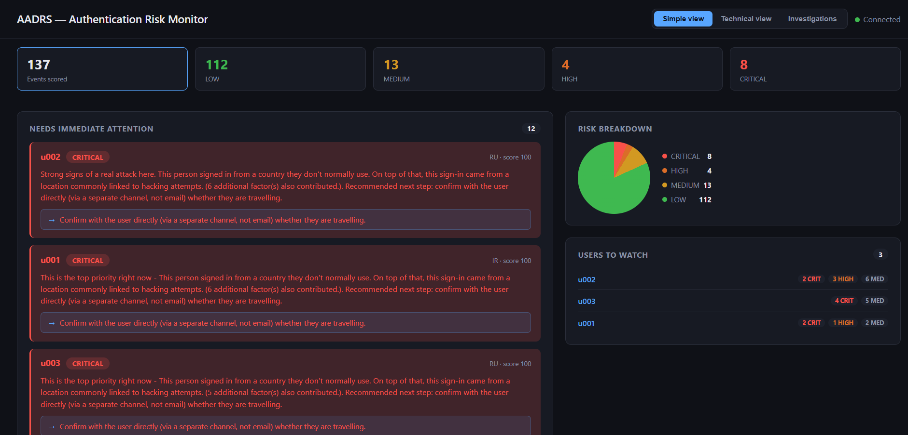
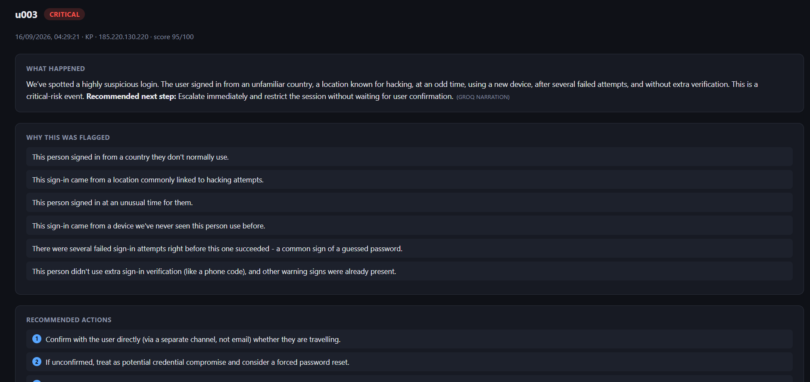
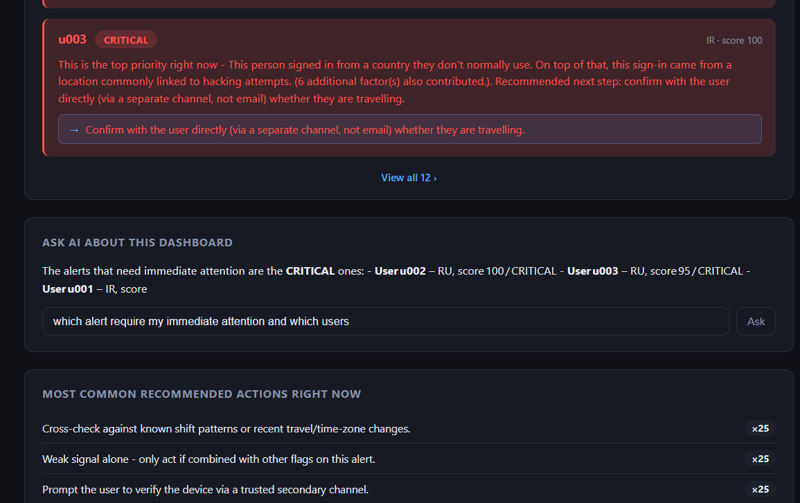

# AADRS — Authentication Anomaly Detection & Risk Scoring

AADRS is an explainable authentication security analytics prototype designed to identify suspicious login activity and prioritise authentication events using a **0–100 risk score**.

Instead of treating every unusual login as a separate alert, AADRS combines multiple signals such as user behaviour, device context, authentication failures, MFA information and geographic context where available.

Every factor contributing to the final score is retained, allowing a security analyst to understand **why an event was considered suspicious** rather than receiving only a black-box result.

> Built as part of my MSc Information & Network Security project.

---

## Demo

## Demo Video

A short silent walkthrough showing the AADRS system running, including the live dashboard, authentication event scoring, alert prioritisation and investigation workflow.

[▶ Watch the AADRS Demo on YouTube](https://youtu.be/dde5IiLehew)

### Security Monitoring Dashboard



### Explainable Investigation



### Ask AI Investigation Assistant



---

## How AADRS Works

```text
Authentication Event
        │
        ▼
Common Event Schema
        │
        ▼
User Baseline + Device Context
        │
        ▼
Rule-Based Detection Engine
        │
        ▼
Triggered Risk Factors
        │
        ▼
Weighted Risk Scoring
        │
        ▼
Risk Score 0–100
        │
        ▼
Low / Medium / High / Critical
        │
        ▼
Explainable Result
        │
        ▼
Analyst Dashboard
```

AADRS also contains an **Isolation Forest** anomaly-detection component.

It operates separately from the primary rule-based scoring engine and is used only for comparison.

```text
Authentication Features
        │
        ▼
Isolation Forest
        │
        ▼
Anomaly Score
        │
        ▼
Comparison with Rule-Based Result
```

The Isolation Forest output is **never added to or combined with the final AADRS risk score**.

---

## Key Features

- Explainable authentication risk scoring from 0–100
- Behavioural user baselines
- Device familiarity and trust context
- Repeated authentication failure detection
- Off-hours authentication detection
- Geographic authentication context
- MFA-aware risk logic
- MITRE ATT&CK mapped detection rules
- Low, Medium, High and Critical risk classification
- Rule-level explanations for every score
- Isolation Forest comparison model
- Authentication event correlation
- FastAPI backend
- SQLite persistence
- WebSocket real-time updates
- Analyst investigation dashboard
- Grounded alert narration
- Ask AI investigation support
- Automated and boundary testing
- Large-scale labelled authentication evaluation

---

## Risk Scoring

Each detection rule contributes a defined number of points when its condition is met.

For example:

```text
Unknown device             +15
5+ recent failures         +20
8+ recent failures         +15
Failed authentication       +5
                           ----
Final Risk Score            55
Risk Level              MEDIUM
```

The final score is capped at **100**.

| Risk Score | Risk Level |
|---:|---|
| 0–29 | Low |
| 30–59 | Medium |
| 60–84 | High |
| 85–100 | Critical |

The individual rule contributions are preserved so the analyst can trace the final score back to the exact conditions that produced it.

---

## Detection Rules

AADRS contains more than ten active authentication detection rules.

| Rule | Detection Condition | Risk Contribution | ATT&CK |
|---|---|---:|---|
| R001 | Authentication from outside the user's usual countries | +15 | — |
| R002 | Authentication from a configured high-risk country | +25 | T1078 |
| R003 | Authentication outside the user's usual login hours | +10 | — |
| R004 | Authentication from an unknown device | +15 | T1078 |
| R005 | Authentication from a known but untrusted device | +10 | — |
| R006 | Authentication from a device with limited login history | +5 | — |
| R007 | 5 or more recent authentication failures | +20 | T1110 |
| R008 | 8 or more recent authentication failures | +15 | T1110.004 |
| R009 | MFA absent when other suspicious factors have already raised risk | +10 | — |
| R010 | Authentication outcome is a failure | +5 | — |
| R012 | 50 or more recent authentication failures | +20 | T1110.004 |

R011 remained an inactive placeholder and is not part of the active ruleset.

---

## Example Detection

A deliberately suspicious authentication event:

```json
{
  "user_id": "demo-user",
  "event_time": "2026-09-16T03:15:00",
  "source_ip": "203.0.113.50",
  "provider": "azure_ad",
  "country_code": "RU",
  "outcome": "failure",
  "mfa_used": false,
  "recent_failure_count": 50,
  "device_fingerprint": "new-device-demo"
}
```

This event can trigger several factors including:

```text
R002  High-risk country
R004  Unknown device
R007  5+ recent failures
R008  8+ recent failures
R009  Missing MFA with existing risk
R010  Failed authentication
R012  50+ recent failures
```

The combined score reaches the maximum:

```text
Risk Score: 100
Risk Level: CRITICAL
```

AADRS also preserves the individual rule contributions so the analyst can understand how the score was produced.

---

## System Architecture

```text
                    ┌────────────────────────┐
                    │  Authentication Event  │
                    └───────────┬────────────┘
                                │
                                ▼
                    ┌────────────────────────┐
                    │   Event Normalisation  │
                    └───────────┬────────────┘
                                │
                                ▼
                    ┌────────────────────────┐
                    │ User + Device Context  │
                    └───────────┬────────────┘
                                │
                ┌───────────────┴───────────────┐
                │                               │
                ▼                               ▼
       ┌──────────────────┐           ┌──────────────────┐
       │    Rule Engine   │           │ Isolation Forest │
       └────────┬─────────┘           └────────┬─────────┘
                │                              │
                ▼                              ▼
       ┌──────────────────┐           ┌──────────────────┐
       │   Risk Scoring   │           │  Anomaly Score   │
       └────────┬─────────┘           └──────────────────┘
                │
                ▼
       ┌──────────────────┐
       │  Explainability  │
       └────────┬─────────┘
                │
                ▼
       ┌──────────────────┐
       │ FastAPI Backend  │
       └────────┬─────────┘
                │
          ┌─────┴─────┐
          │           │
          ▼           ▼
       SQLite      WebSockets
                      │
                      ▼
              Analyst Dashboard
```

The rule-based scoring pathway remains the primary AADRS decision mechanism.

Isolation Forest is maintained as an independent comparison component.

---

## Authentication Event Model

AADRS converts authentication information into a common event structure before detection takes place.

Important event fields include:

| Field | Description |
|---|---|
| `user_id` | Identifier of the authenticating user |
| `event_time` | Authentication event timestamp |
| `source_ip` | Source IP address where available |
| `provider` | Authentication source or provider |
| `country_code` | Country information where available |
| `outcome` | Authentication result |
| `mfa_used` | Whether MFA was used |
| `recent_failure_count` | Recent authentication failure count |
| `device_fingerprint` | Device identifier |

This allows the detection engine to process authentication events consistently regardless of their original source.

---

## Behavioural Context

AADRS evaluates authentication activity using more than the current login event.

The system can consider information such as:

- usual login countries
- usual login hours
- previously observed devices
- device trust
- device login history
- recent authentication failures
- authentication outcome
- MFA usage

This allows the same type of authentication event to receive a different risk score depending on the surrounding user and device context.

---

## Explainability

A major goal of AADRS is to avoid unexplained security scores.

Instead of returning only:

```text
Risk Score: 75
```

AADRS can retain information such as:

```text
Risk Score: 75
Risk Level: HIGH

Triggered Factors

R002  High-risk country              +25
R004  Unknown device                 +15
R007  Multiple authentication failures +20
R009  MFA absent with existing risk  +10
R010  Failed authentication           +5
```

This gives the analyst visibility into:

- which conditions triggered
- why they triggered
- how much each condition contributed
- how the final risk level was reached

The grounded narration and Ask AI components operate on this existing structured information rather than changing the security decision.

---

## Event Correlation

AADRS also contains basic event-correlation logic for identifying relationships between recent authentication events.

Examples include:

```text
FAILURE_THEN_SUCCESS
SAME_IP_MULTIPLE_USERS
REPEATED_HIGH_RISK_USER
```

Correlation provides additional investigation context while keeping the primary event risk score explainable.

---

## Technology Stack

| Area | Technology |
|---|---|
| Language | Python |
| API | FastAPI |
| Storage | SQLite |
| Real-Time Communication | WebSockets |
| Machine Learning | Isolation Forest |
| ML Library | scikit-learn |
| Testing | pytest |
| Security Framework | MITRE ATT&CK |
| Evaluation | Synthetic scenarios + LANL authentication dataset |

---

## API

Important application endpoints include:

```text
/health
/dashboard
/score
/score/compare
/baselines/{user_id}
/devices/{device_fingerprint}
/investigations
/ask
/ws
```

### `/score`

Runs the primary explainable rule-based authentication scoring process.

### `/score/compare`

Allows the rule-based result to be compared with the separate Isolation Forest output.

### `/dashboard`

Provides access to the analyst-facing monitoring interface.

### `/ask`

Allows questions to be asked using information already available within the dashboard context.

### `/ws`

Provides real-time WebSocket updates.

---

## Running the Project

Clone the repository:

```bash
git clone https://github.com/jaden-mas1010/YOUR-REPOSITORY-NAME.git
cd YOUR-REPOSITORY-NAME
```

Create a virtual environment:

```bash
python -m venv .venv
```

Activate it on Windows:

```powershell
.\.venv\Scripts\Activate.ps1
```

Install the project dependencies:

```bash
pip install -r requirements.txt
```

Start the FastAPI backend:

```bash
python -m uvicorn api.app:app --host 127.0.0.1 --port 8001
```

Check that the service is running:

```text
http://127.0.0.1:8001/health
```

Open the analyst dashboard:

```text
http://127.0.0.1:8001/dashboard
```

---

## Testing Strategy

AADRS was evaluated in stages rather than relying on one test.

```text
Automated Tests
      │
      ▼
Boundary Tests
      │
      ▼
Controlled Authentication Scenarios
      │
      ▼
Rule-Based vs Isolation Forest
Sanity Comparison
      │
      ▼
LANL Labelled Evaluation
      │
      ▼
Performance Analysis
```

The final automated test run completed with:

```text
37 passed
1 warning
```

The warning related to zero-variance features in an Isolation Forest test and did not represent a failed test.

---

## Research Background

AADRS was developed as part of an MSc Information and Network Security research project focused on authentication anomaly detection and explainable risk scoring.

The research examined:

- Credential-based authentication threats
- Behavioural baselines and UEBA
- Rule-based authentication detection
- Risk-based authentication
- Isolation Forest anomaly detection
- Explainability in security analytics
- Authentication event correlation and SIEM integration

The project followed a Design Science Research approach, where the problem was studied, a prototype was designed and implemented, and the system was then evaluated using controlled tests and the LANL authentication dataset.

## Research Question

How can suspicious authentication activity be prioritised using an explainable risk-scoring approach while still providing useful context to a security analyst?

## Evaluation

AADRS was evaluated using:

- Automated unit testing
- Boundary testing
- Controlled authentication scenarios
- Rule-based vs Isolation Forest sanity comparison
- Large-scale LANL authentication dataset evaluation

The LANL evaluation processed over 1 billion authentication events.

The results also highlighted limitations in the current rule weights and thresholds, particularly around false positives and the difficulty of transferring assumptions from synthetic authentication behaviour to a large real-world dataset.

## Research Limitations

The current implementation is a research prototype.

Key limitations include:

- Rule weights and thresholds are provisional
- The LANL dataset does not provide all fields used by AADRS, such as MFA and geographical context
- Device information had to be approximated from available LANL fields
- The Isolation Forest model was trained on synthetic normal authentication behaviour and used only as a comparison
- The system has not been evaluated as a production enterprise deployment


## Boundary Testing

Boundary tests were used to verify that detection rules behaved correctly around their thresholds.

Examples include:

| Scenario | Result |
|---|---|
| 4 failures + unknown device | 15 — Low |
| 5 failures + unknown device | 35 — Medium |
| 7 failures + unknown device | 35 — Medium |
| 8 failures + unknown device | 50 — Medium |
| Trusted device with low history | 5 — Low |
| Untrusted established device | 10 — Low |
| 07:59 login + unknown device | 25 — Low |
| 08:00 login + unknown device | 15 — Low |
| No MFA with otherwise normal activity | 0 — Low |
| No MFA + unusual country + unusual hour | 35 — Medium |
| Multiple stacked conditions | 100 — Critical |

These tests verify the implementation of the rule thresholds and risk-score boundaries.

---

## Isolation Forest Comparison

Isolation Forest was implemented as a separate comparison approach rather than as part of the final AADRS score.

A small controlled sanity comparison produced results such as:

| Scenario | Rule Score | Rule Risk | IF Score | IF Risk | Outlier |
|---|---:|---|---:|---|---|
| Normal authentication | 0 | Low | 5 | Low | No |
| Russia at 03:00 | 75 | High | 60 | High | Yes |
| Brute-force scenario | 85 | Critical | 87 | Critical | Yes |
| Slightly early login | 10 | Low | 16 | Low | No |
| Unknown device | 15 | Low | 35 | Medium | No |

The comparison demonstrates that deterministic rules and unsupervised anomaly detection can agree on obvious cases while behaving differently on more ambiguous authentication events.

This comparison was used as a sanity check and was **not the primary formal evaluation**.

---

## Large-Scale LANL Evaluation

The primary labelled evaluation used authentication data from the **Los Alamos National Laboratory dataset**.

AADRS processed:

```text
1,048,746,010 authentication events
```

Within the evaluated data:

```text
669 events corresponded to labelled red-team activity
```

The rule-based system produced the following classification results:

| Classification | Events |
|---|---:|
| True Positives | 8 |
| False Positives | 31,033,057 |
| True Negatives | 1,017,712,284 |
| False Negatives | 661 |

Performance metrics:

```text
Precision:            ~0.00000026
Recall:                0.0120
F1 Score:              ~0.00000052
False Positive Rate:   0.0296
```

The mean risk score across the evaluated authentication stream was:

```text
14.07 / 100
```

---

## Risk Distribution

The final risk-level distribution from the LANL evaluation was:

| Risk Level | Events | Percentage |
|---|---:|---:|
| Low | 1,017,712,945 | 97.04% |
| Medium | 11,379,445 | 1.09% |
| High | 19,390,830 | 1.85% |
| Critical | 262,790 | 0.03% |

More than 31 million events were therefore classified as Medium risk or above.

---

## What the Evaluation Showed

The large-scale evaluation showed that the initial rule weights and thresholds **did not generalise well to the LANL authentication environment**.

Although the implementation and scoring pipeline behaved as designed, the labelled evaluation produced:

- very low recall
- extremely low precision
- a large absolute number of false positives
- excessive activation of some rules
- limited malicious-event detection
- a need for environment-specific rule tuning

This is an important result of the project rather than something hidden from the evaluation.

The prototype demonstrates the technical feasibility of explainable authentication risk scoring while also showing why detection rules and thresholds need to be calibrated against the environment in which they are deployed.

---

## LANL Dataset Adaptation

The LANL authentication dataset does not contain every signal supported by AADRS.

For example, it does not provide real:

- geographic authentication information
- MFA information
- complete enterprise device-trust information

For the LANL evaluation:

```text
First 50 authentication events per user
                │
                ▼
Establish Behavioural Context
                │
                ▼
Subsequent Events
                │
                ▼
AADRS Risk Scoring
                │
                ▼
Compare against Red-Team Labels
```

Successful events within the initial context window were used to establish usual login hours and previously observed computers.

The dataset's timestamp represents elapsed seconds from the beginning of the LANL log rather than a real-world date and time.

The source computer was used as a device proxy for the evaluation.

MFA was neutralised because real MFA information was not available in the dataset.

These limitations are important when interpreting the final results.

---

## Per-Rule Evaluation

Several rules produced large numbers of activations during the LANL evaluation.

Examples include:

| Rule | Total Activations | Labelled Attack Hits |
|---|---:|---:|
| R003 | 942,263,297 | 650 |
| R004 | 259,103,826 | 669 |
| R007 | 30,896,664 | 7 |
| R008 | 26,334,135 | 2 |
| R010 | 12,437,593 | 1 |
| R012 | 18,391,449 | 0 |

The results demonstrated that some conditions occurred frequently during normal authentication behaviour and therefore introduced significant noise.

This highlighted the importance of calibrating behavioural rules against the target environment.

---

## Project Scope

AADRS is a **research proof of concept**, not a production identity-security platform.

The current implementation does not provide:

- enterprise-scale distributed processing
- high availability
- direct integration with every identity provider
- production threat-intelligence feeds
- automatic account blocking
- production-grade rule calibration
- production-grade behavioural modelling

The project focuses on demonstrating and evaluating the core concepts of:

```text
Authentication Monitoring
        +
Behavioural Context
        +
Detection Engineering
        +
Explainable Risk Scoring
        +
Analyst Investigation
```

---

## Security Use

AADRS is intended for:

- defensive cybersecurity research
- authentication monitoring
- detection engineering
- SOC experimentation
- security analytics
- SIEM-related research
- explainable security scoring

The current rule weights and thresholds should **not** be treated as production security recommendations.

Real deployments would require tuning based on the organisation's authentication patterns, available telemetry and risk tolerance.

---

## Future Improvements

Future development could include:

- adaptive risk weights
- environment-specific threshold calibration
- improved behavioural baselines
- richer identity-provider telemetry
- stronger device profiling
- improved authentication-event correlation
- direct SIEM integration
- identity-provider integration
- threat-intelligence enrichment
- improved anomaly-model calibration
- analyst feedback loops
- longer-term behavioural profiling
- additional labelled authentication datasets
- enterprise-scale processing

---

## Repository Structure

```text
AADRS/
│
├── api/
│   └── FastAPI application and API components
│
├── engine/
│   └── Detection, scoring and analysis logic
│
├── eval/
│   └── Evaluation scripts
│
├── tests/
│   └── Automated tests
│
├── static/
│   └── Analyst dashboard
│
├── docs/
│   └── Architecture and project documentation
│
├── screenshots/
│   └── Dashboard and investigation screenshots
│
├── main.py
├── event_simulator.py
├── compare_scorers.py
├── requirements.txt
├── .gitignore
└── README.md
```

---

## Why I Built This

Security teams often have to investigate large numbers of authentication alerts.

A single unusual event does not always mean an account has been compromised.

An employee may legitimately:

- use a new device
- authenticate at an unusual time
- enter the wrong password several times
- travel to a different country

AADRS explores whether several weak authentication indicators can be combined into an understandable risk score while still allowing an analyst to inspect exactly what caused the result.

The project also explores the trade-off between an explainable rule-based system and an unsupervised anomaly-detection model.

---

## What I Learned

This project involved more than building a detection algorithm.

It required working across:

- authentication security
- detection engineering
- behavioural analytics
- risk scoring
- machine learning
- API development
- real-time communication
- data processing
- automated testing
- large-scale security dataset evaluation
- explainability
- security monitoring
- analyst workflow design

One of the most important findings was that a system behaving correctly according to its implementation does not automatically mean that its detection logic will perform well on real authentication data.

The LANL evaluation exposed this clearly and helped identify where the prototype would require further tuning and richer contextual information.

---

## Author

**Jaden Mascarenhas**

MSc Information & Network Security

Cybersecurity | Security Engineering | Detection Engineering | SOC | Security Analytics

GitHub: https://github.com/jaden-mas1010

---

## Disclaimer

AADRS is an academic cybersecurity research prototype intended for defensive security research, testing and experimentation.

It should not be used as the sole mechanism for production authentication decisions, account blocking or access-control enforcement.
